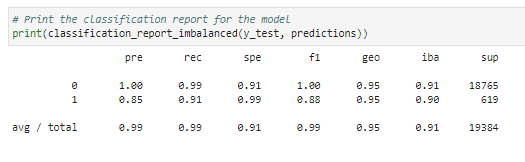
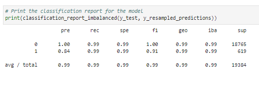

# Credit_risk_analysis

The purpose of the analysis to compare two versions of the dataset  for predicting creditworthiness of borrowers, by using the imbalanced-learn library, logistic regression model. First, prediction is with original dataset and then by resampled data by using the RandomOverSampler module from the imbalanced-learn library.

----

## Technologies

Language: Python 3.9.12

Libraries used:

 Pandas
 Jupyter Labs
 Pathlib
 Scikit-Learn
 Imb-Learn

 ----

 ## Installation Guide

```python
conda install pandas
conda install jupyterlab
conda install -U Scikit-Learn
conda install -c conda-forge imbalanced-learn

Check the to make sure everything has been installed properly
conda list pandas
conda list jupyter lab
conda list Scikit-learn
conda list imb-learn
```

----

## Usage

To run this analysis jupyter lab notebook has been used. To run jupyter lab you need to use GitBash and navigate to where you have exported the files associated with this project and activate your dev environment. Next, this project can be ran by navigating to the crypto_investments.ipynb jupyter notebook file.

----

## Steps Taken

1. Split the Data into Training and Testing Sets

```python
# Separate the data into labels and features

# Separate the y variable, the labels
y = lending_data['loan_status']

# Separate the X variable, the features
X = lending_data.drop(columns = 'loan_status')

# Import the train_test_learn module
from sklearn.model_selection import train_test_split

# Split the data using train_test_split
# Assign a random_state of 1 to the function
X_train, X_test, y_train, y_test = train_test_split(X, y, random_state=1)
```

2. Create a Logistic Regression Model with the Original Data



3. Predict a Logistic Regression Model with Resampled Training Data



----

## Report Summary

Both the models performed very well. Imbalanced data model was able to predict both the high risk and low risk loans accurately by 95% whereas accuracy improved even further by 99% with resampled model. Both the models were great at correctly finding healthy loans with a precision of 100% and recall being 99% the reason being enough data was provided to models to be trained on low risk loans (75000 records) as compare to high risk loans (2500 records).

Imbalance model was able to find high risk loans 91% of the time with 85% precision whereas resampled model was better at finding high risk loans but the precision went down by 1%. Seems like resampled model became too ambitious in finding high risk loans.

So to summaries, resampled model performed better (f1 being 100% for low risk loans and 91% for high risk loans) as compare to original imbalance model (f1 being 100% for low risk loans and 88% for high risk loans). Still both models performed well but they might go in overfitting scenario. That means the model might not perform well with new unseen data. So before choosing any model further analysis must be done to identify overfitting possibilities.

----

## Contributors

Brought to you by Amrita Prithiani

## License

MIT
